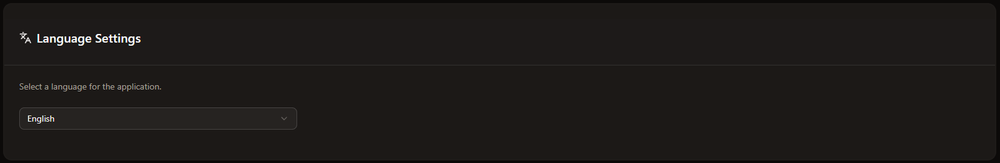

# Settings
Here you can manage the complete settings of CoreControl.

## User Settings

You can change your email and password in the user settings. Please note that you need your old password to change your password.

## Theme Settings

With the theme settings you have the choice between light and dark mode. There is also the option to select “System”, where the system settings are applied.

## Language Settings

To promote internationalization (also often known as i18n), you can select the language in which you want everything to be displayed within CoreControl. Currently there is the standard language “English” and the language German.

## Notification Settings

To receive notifications from CoreControl, you can add all your notification providers here. You can also customize the notification text.